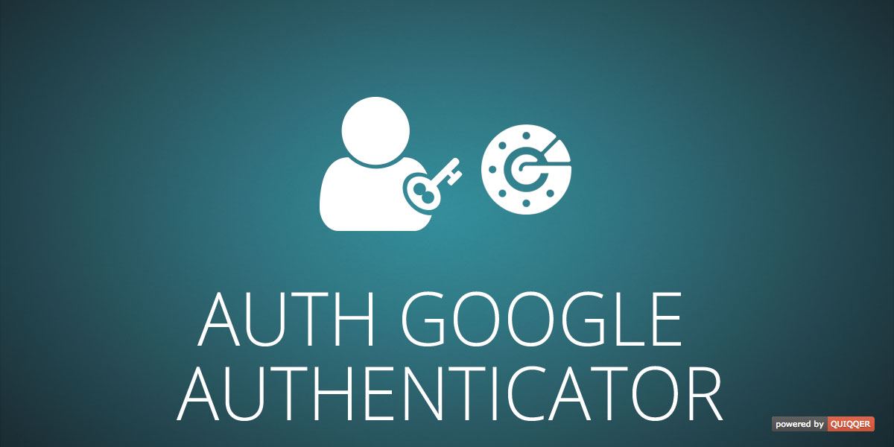

QUIQQER Google Authenticator
========

This module an authentication option for QUIQQER. Backend user accounts can be connected with Google Authenticator
and sign in with a secure code that is periodically regenerated.

Google Authenticator is a mobile app.

Package Name:

    quiqqer/authgoogle2fa

Features
--------
* Authentication via Google Authenticator

Installation
------------
The Package Name is: quiqqer/authgoogle2fa

Contribute
----------
- Project: https://dev.quiqqer.com/quiqqer/authgoogle2fa
- Issue Tracker: https://dev.quiqqer.com/quiqqer/authgoogle2fa/issues
- Source Code: https://dev.quiqqer.com/quiqqer/authgoogle2fa/tree/master

Support
-------
If you have found errors, wishes or suggestions for improvement,
you can contact us by email at support@pcsg.de.

We will transfer your message to the responsible developers.

License
-------
GPL-3.0+